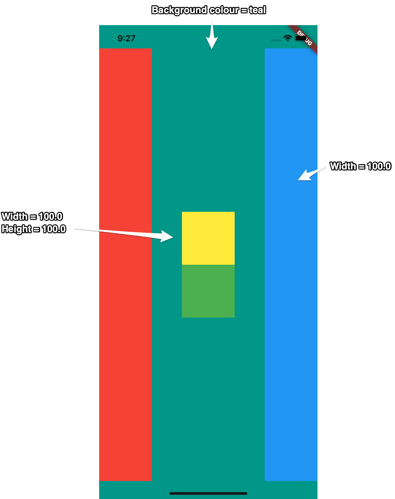

# Mastering Flutter Layouts: Building with Rows, Columns, and SafeAreas

This hands-on project is crafted to help developers hone their skills with essential Flutter layout components. The emphasis lies on leveraging `Row`, `Column`, and `SafeArea` to construct a clean, adaptive interface that's device-friendly.

## Overview of the Project

The objective is to assemble a distinctive arrangement of colored `Container` elements. This exercise reinforces key concepts such as:

- **`SafeArea`**: Protects the interface from overlapping with device features like notches, status indicators, or bottom navigation, guaranteeing optimal visibility.
- **`Row`**: Positions widgets side-by-side horizontally, acting as the core structure for dividing the screen into three segments here.
- **`Column`**: Stacks widgets vertically, employed to layer the pair of central color blocks.
- **`Container`**: A flexible building block for defining sized, colored regions in the design.

## Implementation in Code

The following is the full Dart source code, contained in a `main.dart` file for easy setup and testing.

```dart
import 'package:flutter/material.dart';

void main() {
  runApp(const MyApp());
}

class MyApp extends StatelessWidget {
  const MyApp({super.key});

  @override
  Widget build(BuildContext context) {
    return MaterialApp(
      home: Scaffold(
        backgroundColor: Colors.teal,
        body: Row(
          mainAxisAlignment: MainAxisAlignment.spaceBetween,
          crossAxisAlignment: CrossAxisAlignment.stretch, // Ensures children expand vertically
          children: [
            // Left Section (Red Block)
            SafeArea(
              child: Container(
                width: 100,
                color: Colors.red,
              ),
            ),
            // Central Stack (Yellow and Green Blocks)
            Column(
              mainAxisAlignment: MainAxisAlignment.center,
              children: [
                Container(
                  width: 100,
                  height: 100,
                  color: Colors.yellow,
                ),
                Container(
                  width: 100,
                  height: 100,
                  color: Colors.green, // Specified for better distinction
                ),
              ],
            ),
            // Right Section (Blue Block)
            SafeArea(
              child: Container(
                width: 100,
                color: Colors.blue,
              ),
            ),
          ],
        ),
      ),
    );
  }
}
```

## Visual References

Compare the intended design with the actual rendering from the emulator below.

### Target Design


### Emulator Result


## Key Takeaways

This initiative showcases the power of integrating `Row` and `Column` for intricate designs, while underscoring `SafeArea` as a vital tool for cross-device compatibility. It's an ideal starting point for beginners diving into Flutter's layout system.

## Getting Started with This README

- **Incorporate the Markdown**: Copy this content directly into your `README.md`.
- **Update Image Locations**: Swap out `path/to/challenge_image.png` and `path/to/emulator_output.png` with your real file paths.
- **Personalize It**: Adjust the text or expand sections to fit your project's unique aspects.
